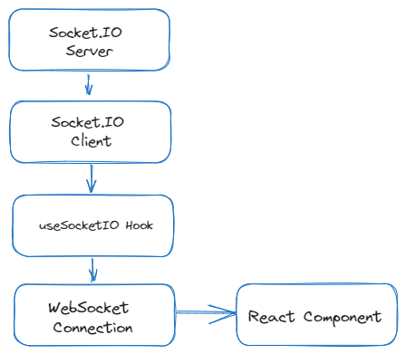

## Описание

```typescript
import {useEffect, useState} from 'react';
import io, {Socket} from 'socket.io-client';

interface SocketIOHook {
    message: string | null;
    sendMessage: (msg: string) => void;
}

function useSocketIO(url: string): SocketIOHook {
    const [socket, setSocket] = useState<Socket | null>(null);
    const [message, setMessage] = useState<string | null>(null);

    useEffect(() => {
        const newSocket = io(url);

        newSocket.on('connect', () => {
            console.log('Socket.IO connected');
        });

        newSocket.on('message', (data: string) => {
            setMessage(data);
        });

        newSocket.on('disconnect', () => {
            console.log('Socket.IO disconnected');
        });

        setSocket(newSocket);

        return () => {
            newSocket.disconnect();
        };
    }, [url]);

    const sendMessage = (msg: string) => {
        if (socket) {
            socket.emit('sendMessage', msg);
        }
    };

    return {message, sendMessage};
}

export {useSocketIO};
```

Этот модуль предоставляет хук `useSocketIO`, который обеспечивает интеграцию с Socket.IO для управления соединением
WebSocket и передачи сообщений.

Хук `useSocketIO` принимает один аргумент:

1. `url` - URL сервера Socket.IO, к которому нужно подключиться.

При вызове хука `useSocketIO` устанавливается соединение с сервером Socket.IO, отслеживаются события и сообщения, а
также предоставляется функция `sendMessage` для отправки сообщений через сокет.

## Использование

Для использования хука `useSocketIO`, следуйте примеру ниже:

1. Установите зависимость `socket.io-client` с помощью npm или yarn:

```bash
npm install socket.io-client
```

2. Ваш компонент:

```tsx
import React from 'react';
import useSocketIO from './useSocketIO';

function SocketIOComponent() {
    const {message, sendMessage} = useSocketIO('http://example.com');

    const handleSendMessage = () => {
        sendMessage('Hello, Socket.IO!');
    };

    return (
        <div>
            <p>Received Message: {message}</p>
            <button onClick={handleSendMessage}>Send Socket.IO Message</button>
        </div>
    );
}

export {SocketIOComponent};
```

Подставьте реальный URL сервера Socket.IO вместо `'http://example.com'`. Хук `useSocketIO` позволяет легко устанавливать
соединение с сервером и передавать сообщения через сокет.

## Диаграмма



Эта диаграмма иллюстрирует взаимодействие между компонентом React, хуком `useSocketIO` и сервером Socket.IO.
Хук `useSocketIO` обеспечивает удобное управление соединением и обменом данными между компонентом React и сервером
Socket.IO.
